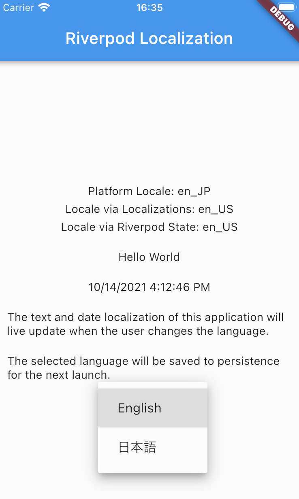

# Riverpod Localization

A demonstration of using Riverpod for dynamic locale switching in-app, with persistence.

# How It Works

- **Fallback Locale**: Declared inside `locale_state.dart`, and set with the @Default decorator.
- **Default Locale**: At startup, gets the system's Platform.localeName (via dart:io) and uses it to set the app's locale.
  - If the platform locale does not match a supported locale
    - The first matching language code locale will be set.
    - Otherwise, the fallback locale will be used.
- **Supported Locales**: These are stored in a provider, accessible from anywhere. Update this list to add more locales.
- **Current Locale**: Accessible from a provider anywhere the ref object is available. Watch this provider to rebuild whenever the locale changes. You can still use `Localizations.localeOf(context)` to get the Locale.

### Locale Changes

- initState sets the initial locale from the platform.

  - App starts up with fallback locale
  - initState immediately attempts to restore a locale from persistent storage to Riverpod state.
  - If there is no locale in storage, attempts to use the Platform's locale.

- The drop down button can be used to select a new locale.

  - This updates state and saves the locale to persistent storage.

- The `MaterialApp()` is wrapped in a Riverpod `ConsumerWidget` which will rebuild automatically anytime the _watched_ `ref.watch()` locale value changes.
- All translated strings are rebuilt as part of this process.

### Platform Locale

The `Platform.locale` property of `dart:io` library only works on mobile. For web, we need to use `dart:html`'s window.navigator.language.
This is implemented with the `PlatformLocale()` interface and conditional imports.

# Author 
>Bagirishya Rwema Dominique